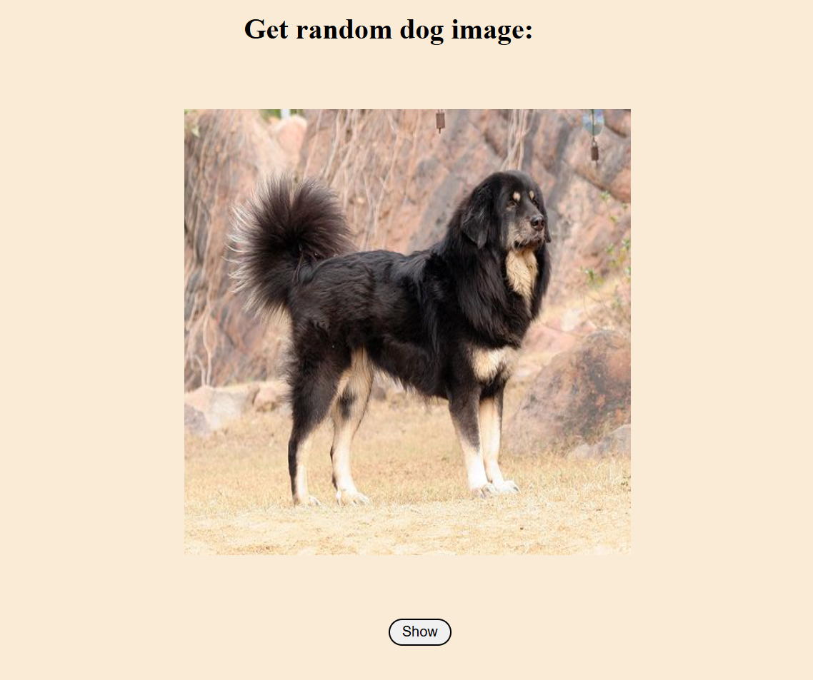

# 🐶 Random Dog Image Viewer

This is a simple web app that fetches and displays a random dog image when the **Show** button is clicked.

## How it looks!!
<p align="center">
  
</p>


## 🚀 Features

- Fetches random dog images
- Simple and clean UI
- Built with HTML, CSS, and JavaScript

## 📸 How it works!

- Click the **Show** button to load a random dog image! 
- Api used = "https://dog.ceo/api/breeds/image/random"

## 🛠️ How to Run

1. Clone the repository:
   ```bash
   git clone https://github.com/your-username/random-dog-viewer.git
   cd random-dog-viewer
2. Open the project:
     Just double-click on index.html

## 👨‍💻 Author
Anuj Singal
